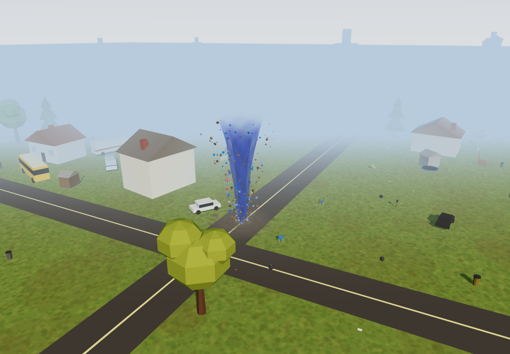

# Graphics quality exit gate

Updated 2026-09-15. Applies to the smoothing/statistics release based on commit `1e779931b914192a576510fcd2b8b19b56ab4ed1`, cache build `2026-09-15-twister-v10-stats`. The user authorized publication on 2026-09-15; deployment history, local checks and physical-device acceptance are separate evidence. The before/after images below are the v9 geometry comparison, before the v10 timer HUD; geometry is unchanged in v10.

## What “smooth enough” means

Keep the friendly toy-like art style, but remove accidental triangle shading, visibly polygonal curved outlines and jagged screen edges. Buildings still have intentional straight walls and roof edges; smoothing must not blur details or turn everything into balloons. A subjective 1–10 art score is useful feedback, but is not the release gate.

The update preserves curved surface normals when combining meshes, bevels substantial box-shaped objects, increases curved geometry resolution, softens tornado edges and shadows, replaces box-shaped airborne debris with rounded particles, and renders at up to 2× display resolution with antialiasing. These shared changes cover the town and space objects; gameplay and progression values are unchanged.

Before (published v8 source, fixed close-view camera):



After (local v9 source, matching camera and world; higher backing resolution is intentional):


## Required gates

All rows are required before calling the graphics accepted on the target iPad. A local pass alone is not release approval.

| Gate | Pass condition | Proof |
|---|---|---|
| Curved surface shading | Actual merged reference sphere normals align with analytical surface normals by dot product ≥0.99; all generated mesh positions are finite and normals have length 1 ±0.001. | `scripts/graphics.test.mjs` |
| Curved outlines | Circular chord error ≤0.75 CSS pixel at the reference sizes below. Rounded boxes retain their original dimensions, flat face centers and beveled edges. | Geometry tests plus visual inspection; segment counts alone do not establish visual acceptance. |
| Raster edges | Actual WebGL antialiasing enabled; backing canvas matches CSS dimensions × min(display DPR, 2), tested at DPR 1 and 2 and in landscape/portrait. No blur filter hiding poor geometry. | `scripts/graphics-gate.mjs`, then target-device inspection. |
| Visual acceptance | At native 100% display size: no unintended faceted tree canopies, wheels or funnel; no obvious stair-stepping on normal-play curved outlines; no new clipping, missing objects, washed-out details or unreadable controls. During movement: no objectionable edge shimmer or tornado seam. Intentional roofs, flat walls and thin rails are exempt from rounding. | Ben's visual signoff on fixed reference views and moving gameplay, recorded against the exact source/build. Automated screenshots are evidence, not a human approval. |
| Sustained target-device performance | On the actual iPad, after warm-up, each busy stage runs for ≥60 seconds at mean ≥50 FPS and 99th-percentile frame interval <33 ms. Touch response ≤2 simulation frames; zero runtime errors or context loss. Exercise growth, absorption, movement and transitions, not just an idle overview. | Record device model, iPadOS/browser version, display mode, build/source hash, settings, frame measurements and complete-loop result. Desktop or emulated touch cannot pass this row. |
| Regression and resource stability | Seeds 1–5 pass all existing logic gates; real touch drag/release and finale reset work; zero offline network requests/errors; graphics geometry/texture counts stop growing after warm-up across three complete stage cycles. | Logic runner and local browser gate, followed by a full target-iPad playthrough. Stable graphics counts are not proof against every kind of memory leak. |

Circular reference bounds use `error = radius × (1 − cos(π / segments))`:

| Reference curved shape | Projected radius (CSS px) | Segments | Maximum circular chord error |
|---|---:|---:|---:|
| Tornado ring | 200 | 64 | 0.241 px |
| Round town object | 150 | 32 | 0.722 px |
| Small round object | 30 | 16 | 0.576 px |
| Space rock | 60 | 20 | 0.739 px |

These are design reference sizes, not a claim that every object has that screen size or that a deformed funnel/irregular rock is a perfect circle. Larger close-ups still require visual review. The reference town render also has a cost guardrail of ≤2.5 million triangles and ≤100 draw calls; this prevents runaway geometry increases but does not guarantee frame rate.

## Repeatable checks

Run from the repository root:

```sh
node --test scripts/*.test.mjs
node sim.mjs --seeds 1-5 --render 0 --gates
node scripts/graphics-gate.mjs --seconds 10
ruby scripts/truth_audit.rb check
```

Both browser runners require an existing Playwright installation; set `PLAYWRIGHT_PATH` if it is not locally resolvable. The graphics runner supports `--executable /path/to/chrome` or `BROWSER_EXECUTABLE`, and `--output /path/to/results`. It never installs dependencies. Unlike `sim.mjs`, which forces software rendering, the graphics runner uses normal Chrome rendering. The toolchain is not pinned yet.

The graphics runner writes a JSON receipt with the exact HTML SHA-256, browser version, dimensions, assertions, frame measurements and fixed screenshots. Frame-rate checks also require advancing game ticks, advancing rendered-frame counts and nonzero drawing, so a stalled/blank renderer cannot pass on a fast browser clock alone. It always marks physical-iPad proof and human visual acceptance `NOT_PROVEN`, even when `localPassed` is true. The default 10-second-per-stage desktop measurement uses stationary, artificially grown scenes, not sustained absorption-heavy play. `--seconds 60` makes it longer but still does not turn a desktop into an iPad.

Reference screenshots use seed 1, blue, tick 120, no camera shake, 1180×820 CSS pixels at DPR 2, with town-start/close/wide and all three space overviews. Camera poses are fixed in the runner. A separate 820×1180 portrait image checks layout. Compare matched views at native scale, and record any intentional visual change rather than blindly accepting a changed screenshot.

## Current evidence and remaining exit conditions

- The 20 geometry/orbital/statistics tests and five-seed progression run pass on the local v10 source.
- Before/after town reference views were inspected: curved tree shading and vehicle edges are visibly smoother. That inspection is not Ben's final art signoff.
- [Local Chrome receipt](graphics-local-receipt.json): all checks passed on v10 HTML SHA-256 `3f044ac37fc41dd822deeb1b4808c6e680f04c9e5a96ba53f92014b67f45f633`; all four 10-second stationary grown-scene samples measured about 60 FPS with 16.8 ms p99 frame intervals and advancing game/render frames. Touch response was one frame; resource counts stabilized; finale-to-results, paused fresh town, Play again reset and zero errors/network checks passed. The receipt's screenshot paths point to temporary v10 artifacts; the selected v9 before/after and space reference views are retained in this documentation. This is not a deployment receipt.
- **Not yet passed:** sustained actual-iPad performance and Ben's moving-gameplay visual acceptance. The graphics must not be described as fully accepted or device-proven until these are recorded.

See the [product audit](audit.md) for the separate category ratings and the [space graphics record](space-visuals.md) for scientific limitations. No paid tools, external assets or runtime network dependencies were added.
