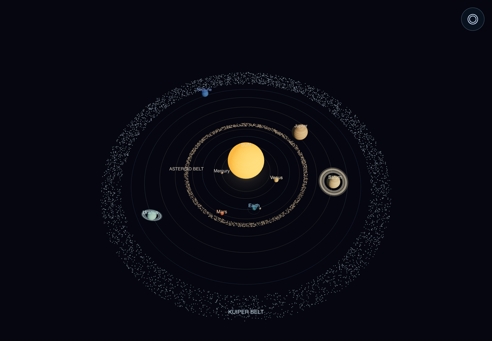
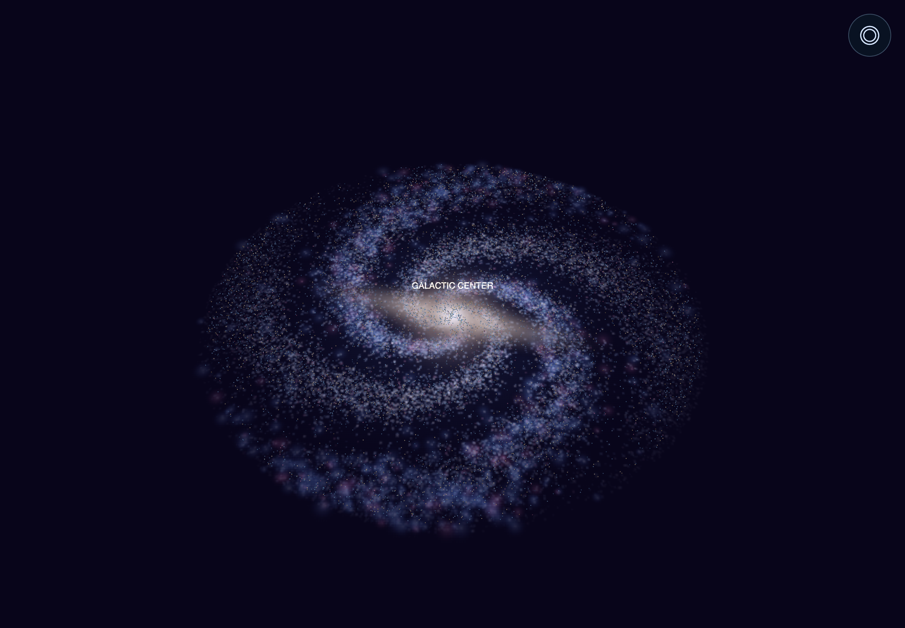
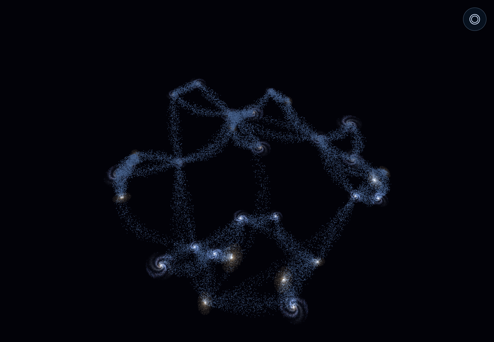

# Space graphics: implementation and verification

Updated 2026-09-15. The feature verification below describes the v8 space update, published as commit `1e779931b914192a576510fcd2b8b19b56ab4ed1`. Screenshots have been refreshed from the local v9 smoothing source; the scientific model and controls are unchanged. See the [graphics exit gate](graphics-exit-gate.md) for current smoothing requirements and device-proof boundaries. [GitHub Pages deployment history](https://github.com/bensl84/twistys-tornado/deployments) separately identifies the published revision.

## What changed

### Solar system

- One Sun and one of each of the eight planets, ordered Mercury through Neptune, with orbit lines and deterministic orbital motion. Inner planets move faster than outer ones.
- Procedural surface textures: rocky/cratered worlds, an ocean-and-continent Earth, Jupiter's cloud bands and Great Red Spot, Saturn's bands, and blue/cyan ice giants. Saturn and Uranus have tilted annular rings.
- A rocky asteroid belt between Mars and Jupiter and an icy Kuiper Belt beyond Neptune.
- The Moon, a satellite, a Space Shuttle-style orbiter and a station follow Earth. The shuttle has delta wings, a dark underside, cockpit and three engines.
- Legacy large solar pickup categories now render as loose rocky/icy aggregates instead of invented extra planets and stars. Their internal IDs and growth values remain to preserve pacing. Unnamed scattered small moons, spacecraft and debris are fictional gameplay resources, not a catalog of the real solar system.

### Milky Way

A warm elongated central bar/bulge, broad winding spiral arms, inter-arm stars and pink/blue star-forming regions replace the previous generic space backdrop. Playable stars and nebulae use soft luminous textures rather than opaque colored balls. The overview depicts the large structure; the closer game view emphasizes collectable stars/clouds and suppresses the enlarged low-resolution backdrop.

### Universe

Galaxies have distinct spiral, barred, elliptical, lenticular, irregular and ring-inspired forms. Groups/clusters are collections of smaller galaxies, quasars have luminous jets, and the overview places galaxy concentrations along broad curved filaments surrounding empty voids. These are representative forms, not positions of named observed galaxies.

## Controls and scientific boundaries

The existing one-finger growth game is preserved. The **◎** button appears only in space. It opens a labeled overview and returns to the following-camera game view when tapped again. Gameplay progression, movement and the v10 run timer pause in the overview; solar orbits continue. The overview hides game-sized pickups/player effects so the astronomical structure is readable. Normal play retains those pickups. The finale now ends on a time/consumption summary; **Play again** starts the next town. See the [README](../README.md) for percentage definitions.

The model deliberately compresses sizes, distances, orbital periods and pickup density. Orbits are circular and coplanar, starting phases are fixed for visibility rather than current ephemerides, textures are hand/procedurally drawn approximations, and spacecraft are enlarged. The shuttle is a historical vehicle illustration, not a claim that shuttles are currently flying. Nebula and cosmic-web colors are illustrative. This is not a planetarium, gravity simulation, astronomical photograph or literal map of the observable universe. Growing a black hole and consuming the universe remain game fiction.

The structural references are NASA's [solar-system facts](https://science.nasa.gov/solar-system/solar-system-facts/), [Kuiper Belt overview](https://science.nasa.gov/solar-system/kuiper-belt/), and [galaxy overview](https://science.nasa.gov/universe/galaxies/). No external images or network-loaded textures are required at runtime.

## Original v8 feature verification on 2026-09-15

- `node --test scripts/space.test.mjs`: **7/7 passed**. Checks all eight planets and Sun, solar order/radii, deterministic movement, Earth companions, lookup of moving bodies, consumed-parent behavior, independent game state and the four stage goals.
- `node sim.mjs --seeds 1-5 --render 0 --gates`: five seeded progression runs; all acceptance gates passed, with zero browser errors, invalid-number events and network requests. The local runner used installed Google Chrome through a temporary Playwright launch adapter because bundled Chromium was unavailable. This bot stops after the universe win; it does not prove the finale by itself.
- Separate offline Chrome interaction run: real touch start/move/end events moved the player and released control. Tapping the overview paused progression, left orbital motion running and suppressed gameplay touch input; returning restored play.
- Landscape 1180×820 and 1280×900, plus portrait 820×1180 screenshots were inspected for v8. The three images above now show the matching local v9 overviews at 1180×820 CSS pixels and DPR 2; image refresh is not a new publication receipt.
- Three town/solar/galaxy/universe rebuild cycles: geometry and texture counts stabilized after warm-up; no browser errors. Cached procedural textures are intentionally reused.
- Separate live finale check: universe win → final animation → new town, incremented seed, cleared fade and hidden space controls passed. The goal was forced through the existing debug helper to isolate the transition; it was not a full manual playthrough.
- A short 120-frame live universe sample in desktop Chrome measured approximately **60 FPS**, with roughly **16.8 ms** 99th-percentile frame interval. This is a narrow desktop smoke sample, not an all-stage benchmark or an iPad performance claim.

Still unverified: the actual target iPad's Safari/touch feel, sound, sustained frame rate, memory, offline home-screen relaunch and complete human playthrough. PWA manifest/icon links remain incomplete, as recorded in the [audit](audit.md).

## Continuation and release state

Repository: `bensl84/twistys-tornado`; Pages source `main:/`; v8 implementation base commit `79869878cf1261d6949539e2a763d77e6d3000c7`. The v8 release commit is `1e779931b914192a576510fcd2b8b19b56ab4ed1`, with cache build `2026-09-15-twister-v8-cosmos`. The subsequent smoothing/statistics release uses `2026-09-15-twister-v10-stats`; the user authorized its publication on 2026-09-15. Deployment history separately identifies the live revision. The overview screenshots remain v9 graphics references; their geometry is unchanged.

Release scope: the prior audit's README, town screenshot and audit/checker files were preserved/reconciled. The graphics update adds runtime/orbit changes in `index.html`, the `sw.js` build bump, `scripts/space.test.mjs`, this record and three space screenshots; it also updates README, audit and documentation classification. The historical `test/` preview is unchanged.

The user authorized v8 GitHub Pages publication on 2026-09-15. Independent release review, a normal fast-forward push, exact-build/live-asset verification and an active service-worker/cache check were completed for that release. This is historical evidence, not proof of v10 publication. Rollback uses a normal revert plus another new BUILD identifier; the prior base remains in Git history. Next device check: run the full game on the target iPad. Publication does not substitute for physical-device evidence or final visual acceptance.
